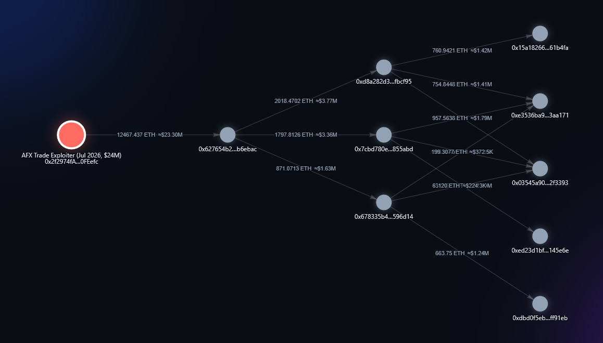
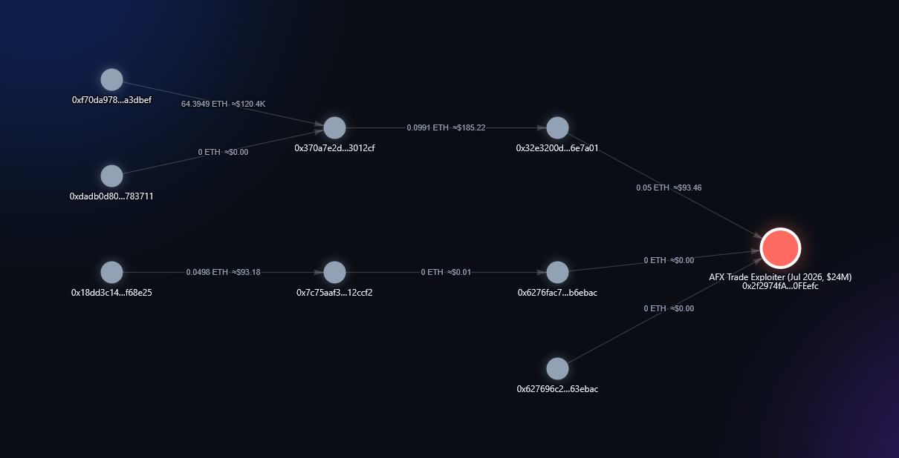

# crypttrace

Open-source OSINT toolkit for crypto investigations. Give it a suspicious
address; it pulls the public on-chain history, labels known entities (exchanges,
mixers, sanctioned wallets), scores risk, and maps where the funds moved —
across Ethereum, Bitcoin, Tron, Solana and more.

Built for the investigation that actually happens: *someone's crypto was stolen,
here's the wallet — where did the money go, and where can it still be stopped?*

Works as a terminal tool **and** as a local web app with an interactive
fund-flow graph.



*Real case: the AFX Trade exploiter (July 2026, $24.15M). crypttrace follows the
stolen ETH out of the attacker's wallet — 12,467 ETH (~$23.3M) to a holding
address, then split across three wallets and split again. Classic layering,
mapped in seconds.*

---

## Install

```bash
git clone https://github.com/bobslayerX/crypttrace
cd crypttrace
pip install -e ".[web]"        # ".[web]" also installs Flask for the web UI
```

### API keys — what's actually required

| | Needed? | How to get it |
|---|---|---|
| **EVM chains** (Ethereum, BSC, Polygon, Arbitrum, Optimism, Base) | **Required** | Free key at [etherscan.io/myapikey](https://etherscan.io/myapikey). One v2 key covers all EVM chains. |
| **Bitcoin, Tron, Solana** | **Not required** | Work out of the box via public endpoints. |

```bash
export ETHERSCAN_API_KEY=xxxx           # required for EVM chains only
```

**About the keyless chains:** Bitcoin, Tron and Solana work with no signup at
all, but their free public endpoints are **rate-limited**. crypttrace handles
this for you — it caches every response, spaces requests out, and retries with
backoff when a limit is hit. For deep traces you can raise the ceiling with your
own credentials (all optional):

```bash
export TRONGRID_API_KEY=xxxx            # optional: higher TronGrid quota
export CRYPTTRACE_SOLANA_RPC=https://…  # optional: your own (faster) Solana RPC
```

## Supported chains

| Chain | `--chain` | Data source | Model |
|---|---|---|---|
| Ethereum, BSC, Polygon, Arbitrum, Optimism, Base | `eth` `bsc` `polygon` `arbitrum` `optimism` `base` | Etherscan v2 | account |
| Bitcoin | `btc` | mempool.space | UTXO |
| Tron (TRX + USDT-TRC20) | `tron` | TronGrid | account |
| Solana (SOL + SPL) | `sol` | public JSON-RPC | account |

Every network is normalized to the same transfer shape, so `profile`, `trace`,
`funder`, `report` and the web graph behave identically everywhere. Bitcoin
additionally unlocks `cluster`. Tron matters for everyday victim cases — most
romance / "pig butchering" scams move USDT-TRC20 because fees are near zero.

---

## Web UI

```bash
crypttrace serve            # then open http://127.0.0.1:8000
```

Paste an address, pick a chain and direction, and get an interactive fund-flow
graph: nodes coloured by what they are, arrows showing where value went, click a
node for its full profile, click a transfer line to open it on the block
explorer. A side panel shows the profile, first-funder chain and off-ramp check.
Everything runs on your machine — nothing is uploaded anywhere.

This exists so non-technical victims can use the tool at all: a form and a
picture, instead of command-line flags.

**Both directions of the same investigation.** Forward — where the stolen money
went:


Backward — how that wallet was funded in the first place, which is how you tie
an anonymous wallet to something identifiable:



## Commands

```bash
# What is this address? (local label DB, works offline)
crypttrace label 0x28c6c06298d514db089934071355e5743bf21d60

# Balance, activity window, risk, top counterparties — on any chain
crypttrace profile 0xADDRESS --chain eth
crypttrace profile bc1qADDRESS --chain btc

# Follow the money, hop by hop, as a coloured tree
crypttrace trace 0xADDRESS --depth 4 --branching 3

# Trace backwards instead: where did this wallet's funds come FROM?
crypttrace trace 0xADDRESS --direction in

# Trace a token rather than the native coin (most thefts are stablecoins)
crypttrace trace 0xADDRESS --asset usdt --depth 4

# Token holdings, valued in USD
crypttrace tokens 0xADDRESS

# Who bootstrapped this wallet's first gas? Follow it toward a KYC point
crypttrace funder 0xADDRESS --hops 6

# Is this an exchange deposit address (i.e. the cash-out point)?
crypttrace offramp 0xADDRESS

# Bitcoin only: find other wallets owned by the same person
crypttrace cluster bc1qADDRESS

# Follow funds across bridges into other chains
crypttrace crosschain 0xADDRESS --window 48

# Watch addresses; alert loudly the moment funds head for an exchange
crypttrace watch add 0xADDRESS --note "my stolen ETH"
crypttrace watch run --interval 300     # or --once for cron / Task Scheduler

# Full investigation report to disk (Markdown + JSON)
crypttrace report 0xADDRESS --depth 3

# Refresh label lists (OFAC sanctions, …)
crypttrace update-labels

# Launch the web UI / list chains
crypttrace serve
crypttrace chains
```

Example trace output:

```
🔴 0x098B716B…3E2f96  [Ronin Bridge Exploiter (Lazarus)]
├── ──33568.15 ETH (1 tx) ≈$63.8M──▶ 🔴 0x35fb6f6d…26d4b1  [OFAC SDN (sanctioned)]
│   └── ↳ trail ends here (identifiable entity — subpoena / off-chain)
└── ──25127.51 ETH (1 tx) ≈$47.7M──▶ ⚪ 0xf7b31119…5cf1be
    └── ──4100.00 ETH (41 tx) ≈$7.8M──▶ 🟣 Tornado Cash: 0.1 ETH
        └── ↳ trail ends here (identifiable entity — subpoena / off-chain)
```

Legend: 🟢 exchange · 🟣 mixer · 🔴 sanctioned/scam · 🌉 bridge · ⚪ unknown

---

## Capabilities in depth

### Tracing (forward and backward)

`trace` follows the largest transfers recursively and stops at identifiable
entities — that's the OSINT handoff point. `--direction out` (default) answers
"where did the money go"; `--direction in` answers "where did this wallet's
money come from", which is how you vet a suspicious address or find a victim's
source of funds.

### Watch & alerts — catching the cash-out

The only window to freeze stolen funds is the moment they reach an exchange
deposit. Victims can't monitor a chain 24/7. `watch` keeps a list of addresses,
detects new activity and raises a **loud HIGH alert** the instant funds move
toward an exchange (directly, or to a detected deposit address); quieter notices
for other movement. It only alerts on activity *after* an address is added, and
never double-alerts.

```bash
crypttrace watch add 0xADDRESS --note "victim funds"
crypttrace watch list
crypttrace watch run --interval 300     # continuous
crypttrace watch run --once             # single check, for scheduled tasks
```

Optional Telegram alerts: set `CRYPTTRACE_TG_TOKEN` and `CRYPTTRACE_TG_CHAT`,
then pass `--telegram`.

### Off-ramp detection

Laundered funds reaching an exchange land on a per-user *deposit address* —
there are millions, so none appear in any label list. `offramp` spots them by
behaviour: an address forwarding most of its outgoing value to a labelled
exchange is almost certainly a deposit address, i.e. the cash-out point where
that exchange holds the depositor's KYC. `trace` applies the same heuristic
automatically, turning an anonymous intermediary into "→ Binance deposit (KYC
point)".

### First-funder (deanonymization)

`funder` follows a wallet's funding link backward: whoever sent its first gas,
then whoever funded that funder. A fresh laundering wallet must be bootstrapped
from somewhere, and the chain frequently terminates at an exchange withdrawal —
an identification point. A core primitive for tying "unrelated" wallets to one
controller. (Uses external transactions; wallets first funded by an internal
contract call need internal-tx data — a planned extension.)

### Bitcoin clustering (common-input-ownership)

Bitcoin's UTXO model enables the strongest clustering heuristic in blockchain
forensics: if several addresses sign the inputs of one transaction, one party
almost certainly controls all of them. `cluster` surfaces those co-signers,
turning a single address into a set of wallets belonging to the same owner. A
strong lead, not proof.

### Cross-chain tracing (bridges)

When funds cross a bridge the trail ends at the bridge contract and reappears on
another chain, with no free deterministic link between the two. `crosschain`
uses a behavioural heuristic that catches many real cases: launderers frequently
bridge to the *same address* they control on the destination chain, so after a
transfer into a known bridge the tool searches every other supported chain for
an inbound transfer to that address of a similar amount (bridges take a fee)
within a time window. Matches are reported with amount and delay — a strong
**lead, not proof**. Recognised bridges: Wormhole, the canonical Optimism /
Arbitrum / Base bridges, Across, Synapse and Celer cBridge (extend the
`"bridge"` entries in `labels/known.json`).

### Assets & USD values

The tracer follows the chain's native coin by default. `--asset` switches to an
ERC-20 token — a known symbol (`usdt`, `usdc`, `dai`, `weth`, `wbtc`) or any
`0x` contract. Amounts carry approximate USD values (stablecoins pinned to $1,
others priced via CoinGecko). If pricing is unavailable, USD shows as `—` rather
than a guess. Token tracing is EVM-only for now; native-coin tracing works on
every chain.

### Labels

Ships a curated seed set (major exchanges, Tornado Cash, bridges, notable
hacks). `update-labels` pulls authoritative public lists — currently the OFAC
SDN sanctioned-address list — and merges them into the local DB in
`~/.crypttrace/`. The curated seed wins on conflicts, so richer names survive.
Add sources in `labels/labels.py` → `SOURCES`.

Labels are currently EVM-focused: on Bitcoin, Tron and Solana most nodes will
show as `unknown`, and `offramp` won't fire there yet.

### Reports

`report` runs the full analysis and writes to `~/crypttrace-reports/` (override
with `--out`): a readable Markdown report (assessment, summary, key findings,
counterparties, the full fund-flow trace, methodology note) plus a `.json` with
the raw structured data.

### Caching & rate limits

Every API response is cached in SQLite under `~/.crypttrace/`, so re-running a
trace — or revisiting an address within one trace — costs no requests. Non-EVM
fetchers additionally throttle per host and retry with exponential backoff on
HTTP 429, so free endpoints degrade gracefully instead of erroring out.

---

## Honest limitations

Read this before relying on the tool — and before promising anything to a
victim.

- **Pseudonymity.** You see that funds landed on `0xABC`, not who owns it. The
  tool brings a trail to a *point of identification* (usually an exchange with
  KYC). The name comes from a legal request to that exchange, not from the chain.
- **Mixers break the trail.** Tornado Cash and privacy pools sever the on-chain
  link. Anything past them is heuristic and not guaranteed.
- **Heuristics are leads, not proof.** Off-ramp detection, cross-chain matching
  and Bitcoin clustering are strong signals that can coincide by chance. Verify
  before acting on them.
- **Labels are only as good as the database.** Unlabelled ≠ innocent.
- **Recovery depends on others.** crypttrace can tell you *when* and *where* to
  act; freezing funds depends on exchanges and law enforcement responding.

## Layout

```
src/crypttrace/
  cli.py           # Typer CLI — every command
  chains.py        # unified multi-chain adapter (one transfer shape for all)
  config.py        # chains, keys, paths
  fetchers/
    etherscan.py   # EVM (Etherscan v2) + SQLite cache
    bitcoin.py     # Bitcoin UTXO (mempool.space) + clustering
    tron.py        # Tron / TRC20 (TronGrid) + base58 conversion
    solana.py      # Solana JSON-RPC
    http.py        # shared cache, throttling, 429 backoff
  labels/
    known.json     # curated label DB
    labels.py      # lookup, risk scoring, source imports
  trace.py         # fund-flow tree + graph builder
  funder.py        # first-funder heuristic
  offramp.py       # exchange-deposit detection
  bridges.py       # cross-chain matching
  watch.py         # watchlist + alerts
  report.py        # Markdown + JSON reports
  prices.py        # USD valuation
  render.py        # rich terminal rendering
  webapp.py        # Flask backend for the web UI
  web/index.html   # single-page frontend (interactive graph)
```

## Roadmap

- Exchange/service labels for Bitcoin, Tron and Solana
- `report --pdf` for exchange and law-enforcement filings
- Internal transactions (completes `funder` and contract-mediated transfers)
- Token tracing on Tron (USDT-TRC20 flows in the graph) and Solana SPL
- More label sources: Chainabuse, CryptoScamDB, exchange deposit-address sets
- Spam/dust token filtering in `tokens`
- Entity clustering on EVM via the gas-funding heuristic

## Contributing

Label data is the highest-leverage contribution: exchange wallets, known scam
and drainer addresses, bridges. Add them to `labels/known.json` (or a new source
in `labels/labels.py`) and open a PR. Accuracy matters more than volume — a
wrong label is worse than no label.

## Licence

MIT — see [LICENSE](LICENSE).

*Use responsibly. This is an investigative aid, not evidence of wrongdoing, and
not a substitute for law enforcement.*
